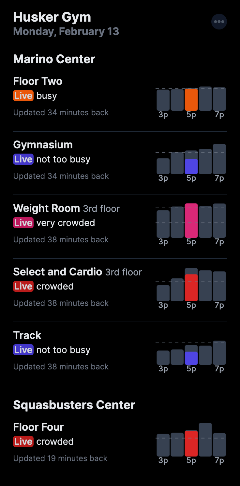
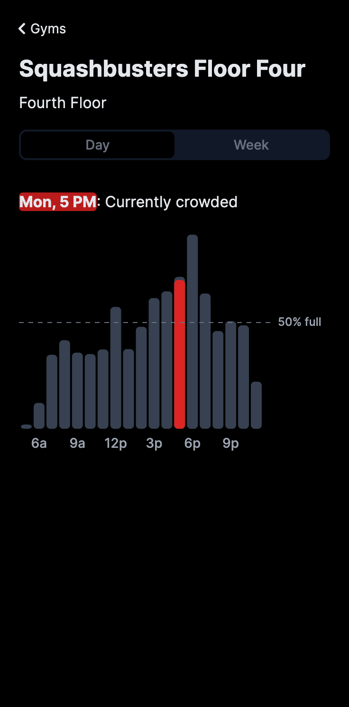
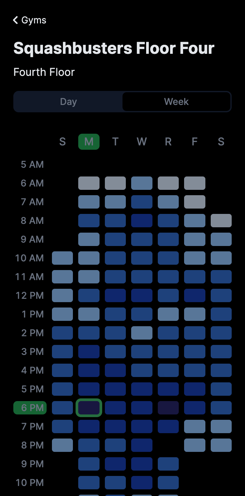
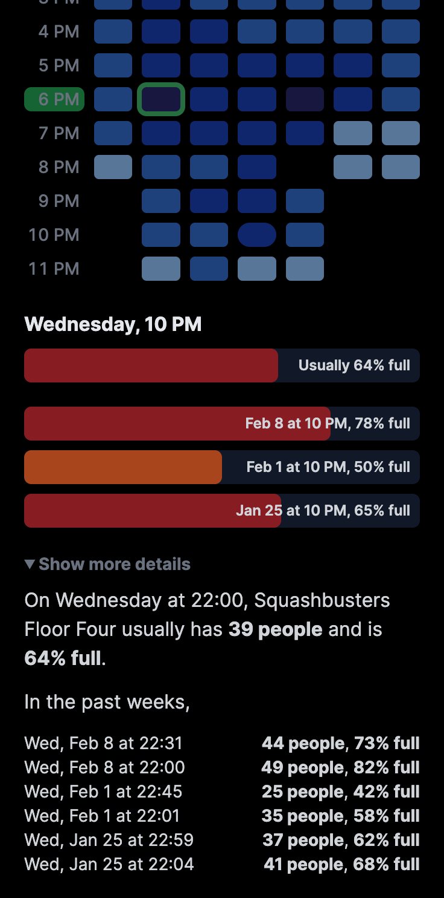

# Husker Gym

> Find the best times to go to the gym

This website displays charts and visualizations to show how crowded the Northeastern gyms usually are. It works by scraping the [live counts website](https://connect2concepts.com/connect2/?type=circle&key=2A2BE0D8-DF10-4A48-BEDD-B3BC0CD628E7) which is updated every 30 minutes or so by the gym proctors. All the scraping is done in [husker-nu/gymtime](https://github.com/husker-nu/gymtime).

If you're interested in getting updates on this project, join the [mailing list](http://eepurl.com/imB7zE).

## Images

<p align="center">
  
  &nbsp;
  
</p>

<p align="center">
  
  &nbsp;
  
</p>

## Development

Connect to the planetscale DB for local development:

```bash
pscale connect gymtime main
```

and set the database URL:

```bash
DATABASE_URL = 'mysql://127.0.0.1:3306/gymtime'
```

## Reference

### Prisma schemas reference

Planetscale does not support foreign keys, so add to `schema.prisma`:

```diff
datasource db {
  provider     = "mysql"
  url          = env("DATABASE_URL")
+ relationMode = "prisma"
}
```

Run `npx prisma db pull`, then add relation fields manually taking reference from the [introspection docs](https://www.prisma.io/docs/getting-started/setup-prisma/add-to-existing-project/relational-databases/introspection-node-planetscale).

### [TODO] Indexes

[Relation mode](https://www.prisma.io/docs/concepts/components/prisma-schema/relations/relation-mode#indexes)

> With `relationMode = "prisma"`, no foreign keys are used, so relation fields will not benefit from the index usually created by the relational database under the hood. This can lead to poor performance when querying these fields. Indexes should be added manually.

### Prisma client

Generate the prisma client with

```bash
npx prisma generate
```
